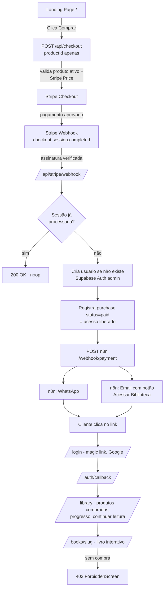
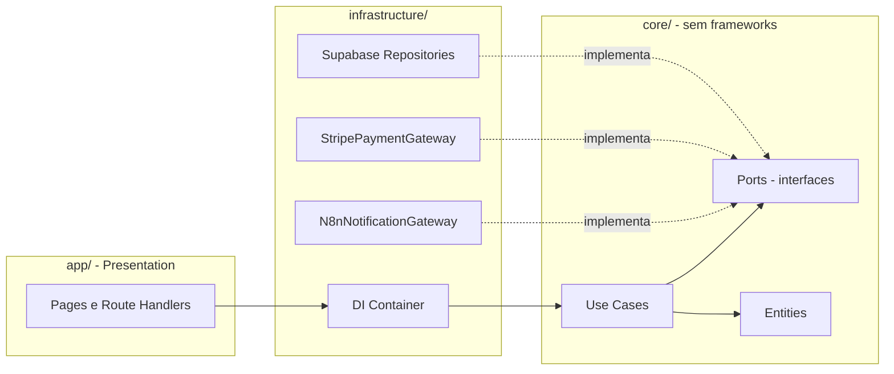

# Arquitetura

## Fluxograma do sistema

## Camadas (Clean Architecture)

## Diagrama das tabelas

```mermaid
erDiagram
    auth_users ||--|| profiles : "1:1 (trigger)"
    auth_users ||--o{ purchases : "user_id"
    products   ||--o{ purchases : "product_id"
    auth_users ||--o{ reading_progress : "user_id"
    products   ||--o{ reading_progress : "product_id"

    products {
        uuid id PK
        text title
        text slug UK
        text description
        text cover
        text type "ebook|course|bundle|subscription|community"
        int price "centavos - display only"
        text currency
        text stripe_price_id
        bool active
        timestamptz created_at
    }
    purchases {
        uuid id PK
        uuid user_id FK
        uuid product_id FK
        text stripe_payment_intent UK
        text stripe_session_id UK
        int amount "centavos, vindo do Stripe"
        text currency
        text status "pending|paid|refunded|failed"
        timestamptz created_at
    }
    profiles {
        uuid id PK "= auth.users.id"
        text name
        text avatar
        text phone
        bool is_admin
        timestamptz created_at
    }
    reading_progress {
        uuid user_id PK_FK
        uuid product_id PK_FK
        int last_page
        int total_pages
        int_array visited
        int_array favorites
        bool completed
        timestamptz last_accessed_at
    }
    webhook_events {
        text id PK "Stripe event id"
        text type
        jsonb payload
        timestamptz processed_at
    }
```

## RLS (resumo)

| Tabela           | anon/auth SELECT           | INSERT/UPDATE                          |
| ---------------- | -------------------------- | -------------------------------------- |
| products         | apenas `active=true` (admin: tudo) | somente admin                    |
| purchases        | somente próprias (admin: tudo)     | **só service role** (webhook)    |
| profiles         | próprio (admin: tudo)      | próprio update (sem escalar is_admin)  |
| reading_progress | próprio                    | próprio, e só se `has_access(product)` |
| webhook_events   | ninguém                    | só service role                        |

## Decisões-chave

- **Preço**: `products.price` é display. Cobrança usa `stripe_price_id`;
  `/api/checkout` recebe apenas `productId` e valida o Price no Stripe.
- **Conta nasce na compra**: o webhook cria o usuário com email confirmado.
  O formulário de login usa `shouldCreateUser: false` (sem signups fantasma).
- **Idempotência dupla**: `webhook_events.id` (evento) + unique
  `purchases.stripe_session_id` (sessão).
- **n8n é só entrega**: WhatsApp/Email. Regra de negócio 100% no Next.js.
- **Multi-produto**: nada é hardcoded; leitor do eBook é resolvido via
  `book-registry` por slug. Cursos/bundles = novo `type` + nova rota de consumo.
